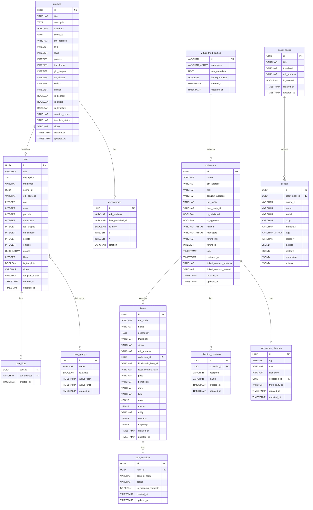

# Database Schema Documentation

This document describes the database schema for the Builder Server. The schema uses PostgreSQL and is managed through migrations located in `migrations/`.

## Database Schema Diagram

## Tables Overview

The database contains the following main tables:

1. **`projects`** - Scene projects created by users
2. **`pools`** - Public scene pools for community sharing
3. **`pool_groups`** - Categories for organizing pools
4. **`pool_likes`** - User likes on pools
5. **`collections`** - Wearable and emote collections
6. **`items`** - Individual wearables and emotes within collections
7. **`collection_curations`** - Curation status for collections
8. **`item_curations`** - Curation status for individual items
9. **`asset_packs`** - Asset pack definitions
10. **`assets`** - Individual 3D assets within packs
11. **`deployments`** - Scene deployment tracking
12. **`virtual_third_parties`** - Third-party provider definitions
13. **`slot_usage_cheques`** - Third-party slot usage records

---

## Table: `projects`

Stores scene projects created by users in the Builder.

### Columns

| Column            | Type      | Nullable | Description                                        |
| ----------------- | --------- | -------- | -------------------------------------------------- |
| `id`              | UUID      | NOT NULL | **Primary Key**. Unique identifier for the project |
| `title`           | VARCHAR   | NOT NULL | Project title                                      |
| `description`     | TEXT      | NULL     | Project description                                |
| `thumbnail`       | VARCHAR   | NULL     | Thumbnail filename                                 |
| `scene_id`        | UUID      | NOT NULL | Scene identifier                                   |
| `eth_address`     | VARCHAR   | NULL     | Owner's Ethereum address (lowercase)               |
| `cols`            | INTEGER   | NOT NULL | Number of columns (parcels X)                      |
| `rows`            | INTEGER   | NOT NULL | Number of rows (parcels Y)                         |
| `parcels`         | INTEGER   | NULL     | Total parcel count                                 |
| `transforms`      | INTEGER   | NULL     | Number of transforms                               |
| `gltf_shapes`     | INTEGER   | NULL     | Number of GLTF shapes                              |
| `nft_shapes`      | INTEGER   | NULL     | Number of NFT shapes                               |
| `scripts`         | INTEGER   | NULL     | Number of scripts                                  |
| `entities`        | INTEGER   | NULL     | Number of entities                                 |
| `is_deleted`      | BOOLEAN   | NOT NULL | Soft delete flag (default: false)                  |
| `is_public`       | BOOLEAN   | NOT NULL | Public visibility flag                             |
| `is_template`     | BOOLEAN   | NULL     | Template flag                                      |
| `creation_coords` | VARCHAR   | NULL     | Creation coordinates                               |
| `template_status` | VARCHAR   | NULL     | Template status: 'active', 'coming_soon'           |
| `video`           | VARCHAR   | NULL     | Video URL                                          |
| `created_at`      | TIMESTAMP | NOT NULL | Creation timestamp                                 |
| `updated_at`      | TIMESTAMP | NOT NULL | Last update timestamp                              |

### Indexes

- **Primary Key**: `id`
- Index on `eth_address`
- Index on `is_deleted`
- Index on `is_template`

### Business Rules

- **Soft delete**: Projects are never hard deleted; `is_deleted` is set to true
- **Address normalization**: `eth_address` is stored in lowercase

---

## Table: `pools`

Stores public scene pools for community sharing. Pools are derived from projects.

### Columns

| Column            | Type      | Nullable | Description                         |
| ----------------- | --------- | -------- | ----------------------------------- |
| `id`              | UUID      | NOT NULL | **Primary Key**. Same as project ID |
| `title`           | VARCHAR   | NOT NULL | Pool title                          |
| `description`     | TEXT      | NULL     | Pool description                    |
| `thumbnail`       | VARCHAR   | NULL     | Thumbnail filename                  |
| `scene_id`        | UUID      | NOT NULL | Scene identifier                    |
| `eth_address`     | VARCHAR   | NULL     | Owner's Ethereum address            |
| `cols`            | INTEGER   | NOT NULL | Number of columns                   |
| `rows`            | INTEGER   | NOT NULL | Number of rows                      |
| `parcels`         | INTEGER   | NULL     | Total parcel count                  |
| `transforms`      | INTEGER   | NULL     | Number of transforms                |
| `gltf_shapes`     | INTEGER   | NULL     | Number of GLTF shapes               |
| `nft_shapes`      | INTEGER   | NULL     | Number of NFT shapes                |
| `scripts`         | INTEGER   | NULL     | Number of scripts                   |
| `entities`        | INTEGER   | NULL     | Number of entities                  |
| `groups`          | UUID[]    | NULL     | Array of pool group IDs             |
| `likes`           | INTEGER   | NOT NULL | Like count (default: 0)             |
| `is_template`     | BOOLEAN   | NULL     | Template flag                       |
| `video`           | VARCHAR   | NULL     | Video URL                           |
| `template_status` | VARCHAR   | NULL     | Template status                     |
| `created_at`      | TIMESTAMP | NOT NULL | Creation timestamp                  |
| `updated_at`      | TIMESTAMP | NOT NULL | Last update timestamp               |

### Indexes

- **Primary Key**: `id`

---

## Table: `pool_groups`

Stores categories for organizing pools.

### Columns

| Column         | Type      | Nullable | Description                       |
| -------------- | --------- | -------- | --------------------------------- |
| `id`           | UUID      | NOT NULL | **Primary Key**. Group identifier |
| `name`         | VARCHAR   | NOT NULL | Group name                        |
| `is_active`    | BOOLEAN   | NULL     | Active status                     |
| `active_from`  | TIMESTAMP | NOT NULL | Active start date                 |
| `active_until` | TIMESTAMP | NOT NULL | Active end date                   |
| `created_at`   | TIMESTAMP | NOT NULL | Creation timestamp                |

### Business Rules

- **Active window**: Groups are active between `active_from` and `active_until`

---

## Table: `pool_likes`

Stores user likes on pools.

### Columns

| Column        | Type      | Nullable | Description                               |
| ------------- | --------- | -------- | ----------------------------------------- |
| `pool_id`     | UUID      | NOT NULL | **Composite Primary Key**. Pool reference |
| `eth_address` | VARCHAR   | NOT NULL | **Composite Primary Key**. User address   |
| `created_at`  | TIMESTAMP | NOT NULL | Like timestamp                            |

### Constraints

- **Composite Primary Key**: (`pool_id`, `eth_address`)
- **One like per user per pool**: Enforced by primary key

---

## Table: `collections`

Stores wearable and emote collections.

### Columns

| Column                    | Type      | Nullable | Description                                       |
| ------------------------- | --------- | -------- | ------------------------------------------------- |
| `id`                      | UUID      | NOT NULL | **Primary Key**. Collection identifier            |
| `name`                    | VARCHAR   | NOT NULL | Collection name                                   |
| `eth_address`             | VARCHAR   | NOT NULL | Owner's Ethereum address                          |
| `salt`                    | VARCHAR   | NULL     | Random salt for contract address generation       |
| `contract_address`        | VARCHAR   | NULL     | Deployed contract address (lowercase)             |
| `urn_suffix`              | VARCHAR   | NULL     | URN suffix for third-party collections            |
| `third_party_id`          | VARCHAR   | NULL     | Third-party provider ID                           |
| `is_published`            | BOOLEAN   | NOT NULL | Publication status                                |
| `is_approved`             | BOOLEAN   | NOT NULL | Approval status                                   |
| `minters`                 | VARCHAR[] | NOT NULL | Array of minter addresses                         |
| `managers`                | VARCHAR[] | NOT NULL | Array of manager addresses                        |
| `forum_link`              | VARCHAR   | NULL     | Forum post URL                                    |
| `forum_id`                | INTEGER   | NULL     | Forum post ID                                     |
| `lock`                    | TIMESTAMP | NULL     | Lock timestamp (prevents edits until publication) |
| `reviewed_at`             | TIMESTAMP | NULL     | Last review timestamp                             |
| `linked_contract_address` | VARCHAR   | NULL     | Linked contract for third-party                   |
| `linked_contract_network` | VARCHAR   | NULL     | Network of linked contract                        |
| `created_at`              | TIMESTAMP | NOT NULL | Creation timestamp                                |
| `updated_at`              | TIMESTAMP | NOT NULL | Last update timestamp                             |

### Indexes

- **Primary Key**: `id`
- Unique index on (`third_party_id`, `urn_suffix`)
- Index on `eth_address`
- Index on `contract_address`

### Business Rules

- **Standard vs Third-Party**: Standard collections have `third_party_id = NULL`; third-party collections have both `third_party_id` and `urn_suffix` set
- **Lock mechanism**: When `lock` is set, the collection cannot be modified until published
- **Address normalization**: All addresses are stored in lowercase

---

## Table: `items`

Stores individual wearables and emotes within collections.

### Columns

| Column               | Type      | Nullable | Description                                                     |
| -------------------- | --------- | -------- | --------------------------------------------------------------- |
| `id`                 | UUID      | NOT NULL | **Primary Key**. Item identifier                                |
| `urn_suffix`         | VARCHAR   | NULL     | URN suffix for third-party items                                |
| `name`               | VARCHAR   | NOT NULL | Item name                                                       |
| `description`        | TEXT      | NOT NULL | Item description                                                |
| `thumbnail`          | VARCHAR   | NOT NULL | Thumbnail hash                                                  |
| `video`              | VARCHAR   | NULL     | Video hash for smart wearables                                  |
| `eth_address`        | VARCHAR   | NOT NULL | Creator's Ethereum address                                      |
| `collection_id`      | UUID      | NULL     | **Foreign Key** to collections                                  |
| `blockchain_item_id` | VARCHAR   | NULL     | Blockchain item ID after publication                            |
| `local_content_hash` | VARCHAR   | NULL     | Local content hash for sync detection                           |
| `price`              | VARCHAR   | NULL     | Item price in wei                                               |
| `beneficiary`        | VARCHAR   | NULL     | Beneficiary address for sales                                   |
| `rarity`             | VARCHAR   | NOT NULL | Rarity: common, uncommon, rare, epic, legendary, mythic, unique |
| `type`               | VARCHAR   | NOT NULL | Type: wearable, emote                                           |
| `data`               | JSONB     | NOT NULL | Type-specific data (wearable/emote metadata)                    |
| `metrics`            | JSONB     | NOT NULL | Model metrics (triangles, materials, etc.)                      |
| `utility`            | VARCHAR   | NULL     | Utility description                                             |
| `contents`           | JSONB     | NOT NULL | Content file hashes                                             |
| `mappings`           | JSONB     | NULL     | Third-party mappings                                            |
| `created_at`         | TIMESTAMP | NOT NULL | Creation timestamp                                              |
| `updated_at`         | TIMESTAMP | NOT NULL | Last update timestamp                                           |

### Indexes

- **Primary Key**: `id`
- Index on `collection_id`
- Index on `eth_address`
- Unique index on (`urn_suffix`) within same third-party

### Business Rules

- **Orphan items**: Items without `collection_id` are orphan items not yet assigned to a collection
- **Publication**: Items are published when `blockchain_item_id` is set
- **Content sync**: `local_content_hash` is compared with curation `content_hash` to detect changes

---

## Table: `collection_curations`

Stores curation status for collections.

### Columns

| Column          | Type      | Nullable | Description                          |
| --------------- | --------- | -------- | ------------------------------------ |
| `id`            | UUID      | NOT NULL | **Primary Key**. Curation identifier |
| `collection_id` | UUID      | NOT NULL | **Foreign Key** to collections       |
| `assignee`      | VARCHAR   | NULL     | Committee member assigned            |
| `status`        | VARCHAR   | NOT NULL | Status: pending, approved, rejected  |
| `created_at`    | TIMESTAMP | NOT NULL | Creation timestamp                   |
| `updated_at`    | TIMESTAMP | NOT NULL | Last update timestamp                |

### Indexes

- **Primary Key**: `id`
- Index on `collection_id`

### Business Rules

- **Latest curation**: The most recent curation (by `created_at`) is the active one
- **Assignee**: Only committee members can be assigned

---

## Table: `item_curations`

Stores curation status for individual items (third-party items).

### Columns

| Column                | Type      | Nullable | Description                          |
| --------------------- | --------- | -------- | ------------------------------------ |
| `id`                  | UUID      | NOT NULL | **Primary Key**. Curation identifier |
| `item_id`             | UUID      | NOT NULL | **Foreign Key** to items             |
| `content_hash`        | VARCHAR   | NOT NULL | Content hash at time of curation     |
| `status`              | VARCHAR   | NOT NULL | Status: pending, approved, rejected  |
| `is_mapping_complete` | BOOLEAN   | NULL     | Whether mappings are complete        |
| `created_at`          | TIMESTAMP | NOT NULL | Creation timestamp                   |
| `updated_at`          | TIMESTAMP | NOT NULL | Last update timestamp                |

### Indexes

- **Primary Key**: `id`
- Index on `item_id`

---

## Table: `asset_packs`

Stores asset pack definitions.

### Columns

| Column        | Type      | Nullable | Description                            |
| ------------- | --------- | -------- | -------------------------------------- |
| `id`          | UUID      | NOT NULL | **Primary Key**. Asset pack identifier |
| `title`       | VARCHAR   | NOT NULL | Pack title (3-20 characters)           |
| `thumbnail`   | VARCHAR   | NULL     | Thumbnail filename                     |
| `eth_address` | VARCHAR   | NULL     | Owner's Ethereum address               |
| `is_deleted`  | BOOLEAN   | NOT NULL | Soft delete flag                       |
| `created_at`  | TIMESTAMP | NOT NULL | Creation timestamp                     |
| `updated_at`  | TIMESTAMP | NOT NULL | Last update timestamp                  |

### Indexes

- **Primary Key**: `id`
- Index on `eth_address`

### Business Rules

- **Default packs**: Packs with the default eth address are available to all users
- **Soft delete**: Asset packs are soft deleted
- **Asset limit**: Max 80 assets per pack (for packs created after limit split date)

---

## Table: `assets`

Stores individual 3D assets within packs.

### Columns

| Column          | Type      | Nullable | Description                       |
| --------------- | --------- | -------- | --------------------------------- |
| `id`            | UUID      | NOT NULL | **Primary Key**. Asset identifier |
| `asset_pack_id` | UUID      | NOT NULL | **Foreign Key** to asset_packs    |
| `legacy_id`     | VARCHAR   | NULL     | Legacy identifier for migration   |
| `name`          | VARCHAR   | NOT NULL | Asset name (3-50 characters)      |
| `model`         | VARCHAR   | NOT NULL | Model filename                    |
| `script`        | VARCHAR   | NULL     | Script filename                   |
| `thumbnail`     | VARCHAR   | NULL     | Thumbnail filename                |
| `tags`          | VARCHAR[] | NOT NULL | Search tags                       |
| `category`      | VARCHAR   | NOT NULL | Asset category                    |
| `metrics`       | JSONB     | NOT NULL | Model metrics                     |
| `contents`      | JSONB     | NOT NULL | Content file mappings             |
| `parameters`    | JSONB     | NULL     | Configurable parameters           |
| `actions`       | JSONB     | NULL     | Available actions                 |

### Indexes

- **Primary Key**: `id`
- Index on `asset_pack_id`

---

## Table: `deployments`

Stores scene deployment tracking.

### Columns

| Column               | Type    | Nullable | Description                             |
| -------------------- | ------- | -------- | --------------------------------------- |
| `id`                 | UUID    | NOT NULL | **Primary Key**. Same as project ID     |
| `eth_address`        | VARCHAR | NULL     | Deployer's address                      |
| `last_published_cid` | VARCHAR | NULL     | Last published content ID               |
| `is_dirty`           | BOOLEAN | NOT NULL | Whether project has unpublished changes |
| `x`                  | INTEGER | NOT NULL | Parcel X coordinate                     |
| `y`                  | INTEGER | NOT NULL | Parcel Y coordinate                     |
| `rotation`           | VARCHAR | NOT NULL | Rotation: north, east, south, west      |

### Indexes

- **Primary Key**: `id`

---

## Table: `virtual_third_parties`

Stores third-party provider definitions created through the Builder.

### Columns

| Column           | Type      | Nullable | Description                             |
| ---------------- | --------- | -------- | --------------------------------------- |
| `id`             | VARCHAR   | NOT NULL | **Primary Key**. Third-party URN        |
| `managers`       | VARCHAR[] | NOT NULL | Manager addresses                       |
| `raw_metadata`   | TEXT      | NOT NULL | Raw metadata JSON                       |
| `isProgrammatic` | BOOLEAN   | NOT NULL | Whether it's a programmatic third party |
| `created_at`     | TIMESTAMP | NOT NULL | Creation timestamp                      |
| `updated_at`     | TIMESTAMP | NOT NULL | Last update timestamp                   |

### Indexes

- **Primary Key**: `id`

### Business Rules

- **Virtual vs On-chain**: Virtual third parties exist only in the database until added to the blockchain
- **Deletion**: Can only be deleted after being added to the graph

---

## Table: `slot_usage_cheques`

Stores third-party slot usage cheques for item publication.

### Columns

| Column           | Type      | Nullable | Description                        |
| ---------------- | --------- | -------- | ---------------------------------- |
| `id`             | UUID      | NOT NULL | **Primary Key**. Cheque identifier |
| `qty`            | INTEGER   | NOT NULL | Number of slots used               |
| `salt`           | VARCHAR   | NOT NULL | Random salt for signature          |
| `signature`      | VARCHAR   | NOT NULL | Cryptographic signature            |
| `collection_id`  | UUID      | NOT NULL | **Foreign Key** to collections     |
| `third_party_id` | VARCHAR   | NOT NULL | Third-party identifier             |
| `created_at`     | TIMESTAMP | NOT NULL | Creation timestamp                 |
| `updated_at`     | TIMESTAMP | NOT NULL | Last update timestamp              |

### Indexes

- **Primary Key**: `id`
- Index on `collection_id`
- Index on `third_party_id`

### Business Rules

- **One cheque per collection**: Each collection has at most one active cheque
- **Signature verification**: Signature is verified against third-party manager

